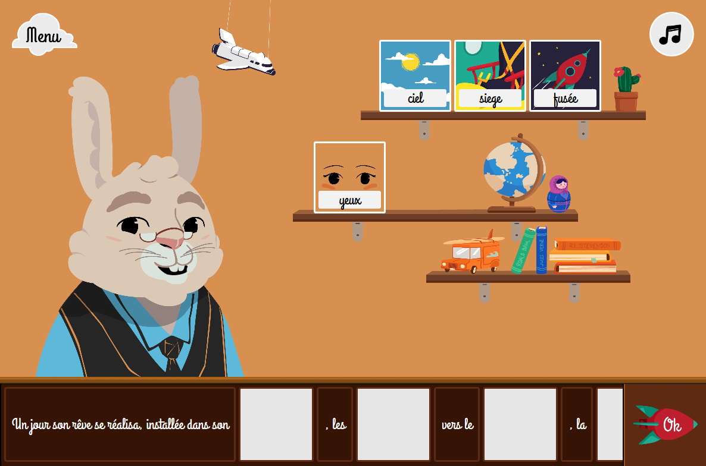

# Scribee
Scribee is a story-based game for children to help them learn words with cards to drag and drop in the sentences.

# Acknowledgements
All the wonderful story images and the game UI was drawn by the awesome Joris Discepoli (aka. Okionero), you can find more of his work on his website: [okionero.com](http://okionero.com/)
